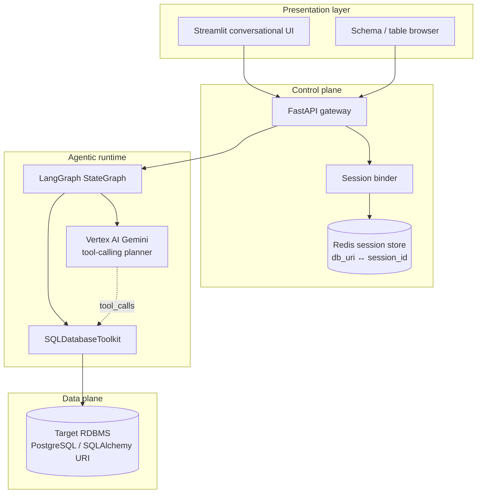
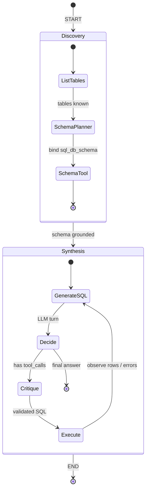
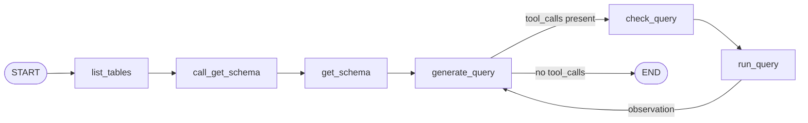
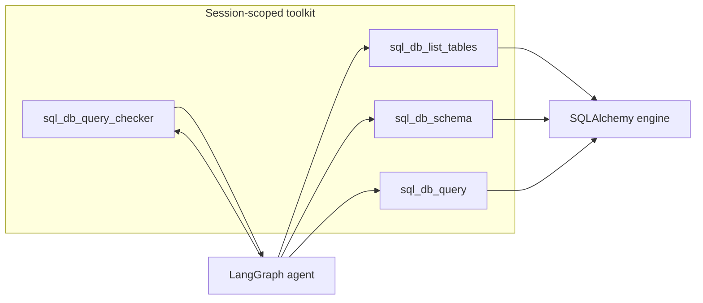
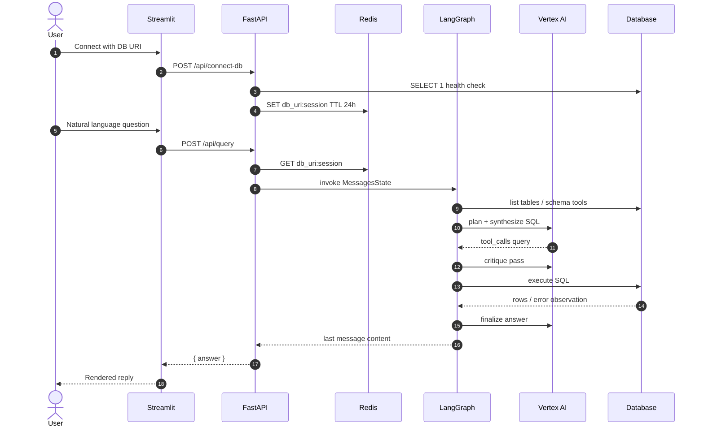

# Agentic architecture

This document describes the multi-node LangGraph runtime that powers Text-to-SQL Agent: grounded schema discovery, SQL synthesis, critique, and tool execution in a closed loop.

## System context

## Cognitive loop

Each natural-language question compiles into a **stateful agent graph**. Messages accumulate in `MessagesState`; the model never sees a raw URI — only tool results and dialect-aware prompts.

## Node responsibilities

| Node | Kind | Responsibility |
|------|------|----------------|
| `list_tables` | Tool bootstrap | Enumerate relations via `sql_db_list_tables` |
| `call_get_schema` | LLM + tools | Choose which tables need `sql_db_schema` |
| `get_schema` | ToolNode | Materialize DDL / column metadata into state |
| `generate_query` | LLM + tools | Intent → dialect-correct SQL (or natural-language answer) |
| `check_query` | LLM critic | Second-pass review for NULL/`UNION`/cast/join mistakes |
| `run_query` | ToolNode | Execute via `sql_db_query`, feed observations back |

## Control flow (compiled graph)

The **generate → check → run → generate** cycle is the agentic heart of the system: the model can revise SQL after seeing execution feedback instead of failing on the first draft.

## Tool surface

Tools are **rebound per `session_id`**: Redis resolves the URI, `SQLDatabaseToolkit` builds a fresh toolset, and ToolNodes wrap schema/query execution for the graph.

## Request lifecycle

## Design properties

- **Grounded generation** — SQL is produced only after table listing and schema fetch, reducing hallucination of columns.
- **Critic-before-execute** — a dedicated check node reviews SQL before the run tool fires.
- **Observation loop** — failed or partial runs return into `generate_query` for another planner turn.
- **Session isolation** — each browser session owns its own URI binding; the graph is compiled per request against that binding.
- **Dialect awareness** — prompts inject `db.dialect` so Postgres vs other engines stay consistent.
